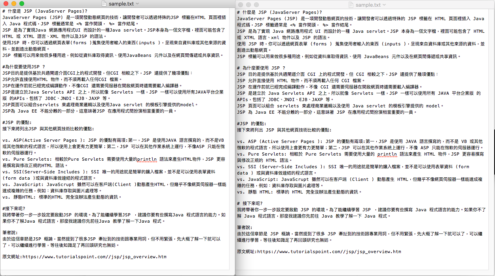

# AutoCorrectChineseText
# 自動中文排版工具

此工具用於統一中文文案、排版，降低團隊成員之間的溝通成本，增強網站氣質。

其統一中文文案與排版格式皆參考[中文文案排版指北](https://github.com/sparanoid/chinese-copywriting-guidelines)。

此工具是基於 [NauxLiu/auto-correct](https://github.com/NauxLiu/auto-correct) 做出來的「自動中文排版工具」。



## 安裝：
將 AutoCorrectChineseText Clone 下來即可。

## 使用方式：
注意：AutoCorrectChineseText 必須是在 PHP-CLI 模式下進行：

   將要進行排版的檔案放到 AutoCorrectChineseText 目錄下，在用 PHP-CLI執行 AutoCorrect.php，即可進行排版，並且將排版完成的檔案放置在 Outputs 目錄內。

### 步驟：
  * 把要進行排版的檔案放到 AutoCorrectChineseText 目錄下。
  * cd 到 AutoCorrectChineseText 下。
  * 執行 AutoCorrect.php。

```
cd path/to/AutoCorrectChineseText
php AutoCorrect.php InputFile OutputFile
```

若 OutputFile 沒定義的話，預設輸出的檔案名稱會與輸入檔案名稱相同。

注意：此版本目前只有測試過 txt 檔案可正常排版。
