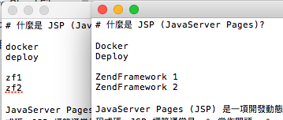

# AutoCorrectChineseTypesetting
# 自動校正中文文案排版（For 檔案）

[](https://wadehuanglearning.blogspot.com/)

[](https://opensource.org/licenses/MIT)


此工具針對「檔案」校正中文文案的排版，統一中文文案與排版格式皆參考[中文文案排版指北](https://github.com/sparanoid/chinese-copywriting-guidelines)。

此工具是基於 [NauxLiu/auto-correct](https://github.com/NauxLiu/auto-correct) 做出來的「自動中文排版工具」。


## 安裝要求：
  * PHP 5.6+

## 安裝：
將 AutoCorrectChineseTypesetting Clone 下來即可。

## 使用說明：
AutoCorrectChineseTypesetting 必須在 PHP-CLI 模式下進行：

   * 將要進行排版的檔案放到 AutoCorrectChineseTypesetting 目錄下。
   * 使用 PHP-CLI 執行 AutoCorrect.php 校正中文文案排版。
   * AutoCorrect.php 會自動將校正完成的檔案輸出至 Outputs 目錄內。

### 步驟：
在 Command-Line 模式中：
```
cd path/to/AutoCorrectChineseTypesetting
php AutoCorrect.php -i InputFile -o OutputFile
```
若 OutputFile 沒定義的話，預設輸出的檔案名稱會與輸入檔案名稱相同。

### 可用參數：
```
-i  要做排版的檔案名稱。
-o  輸出的檔案名稱（可選）。
-a  新增校正辭彙庫（可選，可多次新增）。
-h  查看使用說明。
```

### 新增辭彙庫

`-a` 參數提供了新增辭彙庫的功能：

 * 將您要新增的辭彙庫（xxx.php）放置於 dictionary 目錄下。
 * 執行 AutoCorrect.php 並使用 `-a` 參數加載辭彙庫。
 * 可多次使用 -a 參數，加載多個辭彙庫。

辭彙庫必須為 `*.php` 檔案，其內容為：
```php
<?php
return [
   # '校正前的字詞' => '校正後的字詞',
   /**
    * ...將您的新詞彙加入於此。
    */
   'docker' => 'Docker',
   'deploy' => 'Deploy',
   'zf1' => 'ZendFramework 1',
   'zf2' => 'ZendFramework 2',
];
```

#### 範例：使用 -a 參數，加載多個辭彙庫。
 ```
cd path/to/AutoCorrectChineseTypesetting
php AutoCorrect.php -i InputFile -a dictionary/AAA.php -a dictionary/BBB.php
 ```


## 注意：
此版本目前只有測試過 txt 檔案可正常排版。

## License
  * [MIT](https://opensource.org/licenses/MIT)

## TODO：
  * 加入 AutoCorrectChineseTypesetting 單元測試。


